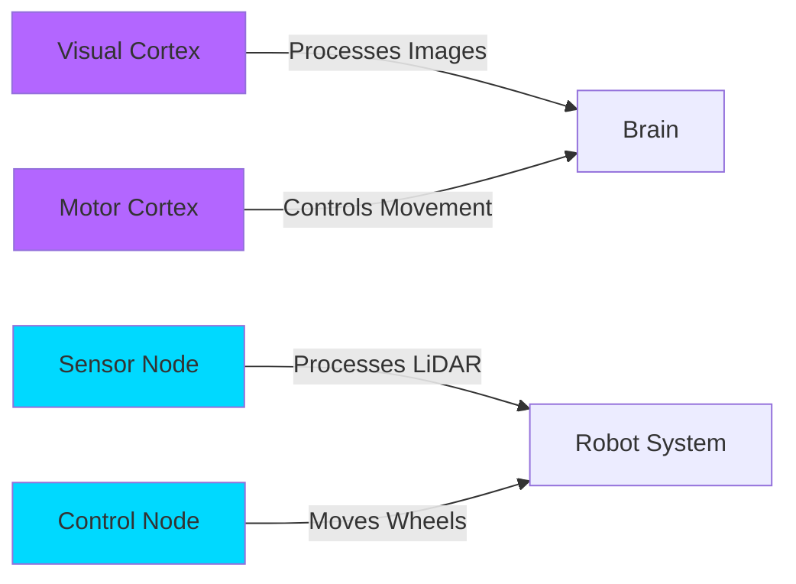
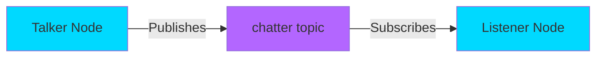

# ROS 2 Nodes: The Brain's Functional Units

**Learning Objectives**:
- Understand what ROS 2 nodes are and their role in robotics
- Learn the biological analogy: nodes as functional brain regions
- Write your first ROS 2 node in Python

**Prerequisites**: Basic Python knowledge, ROS 2 Humble installed

**Estimated Time**: 45 minutes

---

## What is a ROS 2 Node?

In the robotic nervous system, a **node** is like a specialized region of the brain—each handles a specific task. Just as your visual cortex processes images and your motor cortex controls movement, ROS 2 nodes are independent programs that perform specific functions like reading sensor data, controlling motors, or making decisions.

:::tip Key Concept
Think of ROS 2 nodes as individual programs that communicate with each other to make the robot work as a whole system.
:::

---

## The Biological Analogy



Just as your brain has specialized regions:
- **Visual Cortex** → **Camera Node** (processes images)
- **Motor Cortex** → **Motor Controller Node** (moves actuators)
- **Auditory Cortex** → **Microphone Node** (processes sound)

---

## Your First Node: The Talker

Let's create a simple publisher node that sends messages.

### Code Example: Talker Node

```python
# Example: Minimal ROS 2 publisher node
# File: talker.py

import rclpy
from rclpy.node import Node
from std_msgs.msg import String

class TalkerNode(Node):
    """Publishes messages to the 'chatter' topic."""

    def __init__(self) -> None:
        super().__init__('talker')
        # Create publisher: topic='chatter', message type=String, queue size=10
        self.publisher = self.create_publisher(String, 'chatter', 10)
        # Timer fires every 1.0 seconds
        self.timer = self.create_timer(1.0, self.publish_message)
        self.counter = 0

    def publish_message(self) -> None:
        """Callback: publishes a message every timer tick."""
        msg = String()
        msg.data = f'Hello from Physical AI! Message #{self.counter}'
        self.publisher.publish(msg)
        self.get_logger().info(f'Publishing: {msg.data}')
        self.counter += 1

def main(args=None):
    rclpy.init(args=args)
    node = TalkerNode()
    try:
        rclpy.spin(node)  # Keep node alive
    except KeyboardInterrupt:
        pass
    finally:
        node.destroy_node()
        rclpy.shutdown()

if __name__ == '__main__':
    main()
```

**How to run**:
```bash
# Save the code as talker.py
# Run the node
python3 talker.py
```

**Expected output**:
```
[INFO] [talker]: Publishing: Hello from Physical AI! Message #0
[INFO] [talker]: Publishing: Hello from Physical AI! Message #1
[INFO] [talker]: Publishing: Hello from Physical AI! Message #2
...
```

**Try it yourself**:
- Change the timer frequency to `0.5` for faster messages
- Add a timestamp to each message
- Modify the message content to include sensor data

---

## How Nodes Communicate

Nodes don't just exist in isolation—they talk to each other using **topics** (which we'll cover next).



---

## Hands-On Exercise

**Challenge**: Create a node called `counter_node` that:
- Publishes a number that increments every second
- Uses the topic `/count`
- Logs each published value

**Acceptance Criteria**:
- [ ] Node runs without errors
- [ ] Counter increments correctly
- [ ] You can see the output using `ros2 topic echo /count`

**Hints**:
- Start with the `TalkerNode` example above
- Use `std_msgs/Int32` instead of `String`
- Remember to import `Int32` from `std_msgs.msg`

---

## Summary

**Key Takeaways**:
- ROS 2 nodes are independent programs that perform specific tasks
- Nodes communicate via topics (publish/subscribe pattern)
- Each node runs in its own process
- The `rclpy` library provides Python bindings for ROS 2

**Next Steps**: In the [next chapter](./02-python-agents.md), we'll build more complex nodes and explore the publisher-subscriber pattern in depth.

---

## Further Reading

- [ROS 2 Official Docs: Creating a Node](https://docs.ros.org/en/humble/Tutorials/Beginner-Client-Libraries/Writing-A-Simple-Py-Publisher-And-Subscriber.html)
- [ROS 2 Concepts: Nodes](https://docs.ros.org/en/humble/Concepts/About-Nodes.html)
- [rclpy API Documentation](https://docs.ros2.org/latest/api/rclpy/)
