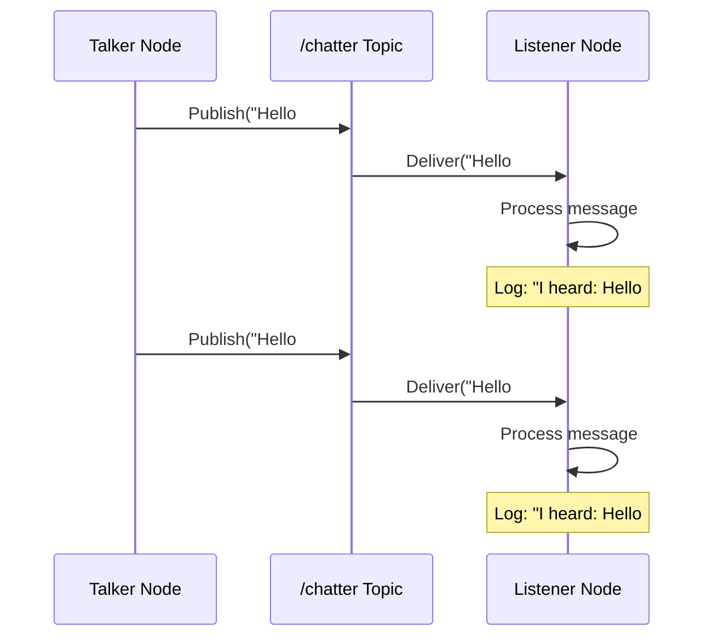

# Python ROS 2 Agents: Building Intelligent Nodes

**Learning Objectives**:
- Master the publisher-subscriber pattern
- Create nodes that both send and receive data
- Build a listener node to complement your talker
- Understand message types and custom communication

**Prerequisites**: Completed "ROS 2 Nodes" chapter, Python OOP knowledge

**Estimated Time**: 1 hour

---

## The Listener: Receiving Messages

Now that we have a talker that publishes messages, let's create a listener that subscribes to those messages.

### Code Example: Listener Node

```python
# Example: ROS 2 subscriber node
# File: listener.py

import rclpy
from rclpy.node import Node
from std_msgs.msg import String

class ListenerNode(Node):
    """Subscribes to messages on the 'chatter' topic."""

    def __init__(self) -> None:
        super().__init__('listener')
        # Create subscriber: topic='chatter', message type=String
        self.subscription = self.create_subscription(
            String,
            'chatter',
            self.listener_callback,
            10  # Queue size
        )
        self.subscription  # Prevent unused variable warning

    def listener_callback(self, msg: String) -> None:
        """Callback: executed every time a message is received."""
        self.get_logger().info(f'I heard: "{msg.data}"')

def main(args=None):
    rclpy.init(args=args)
    node = ListenerNode()
    try:
        rclpy.spin(node)
    except KeyboardInterrupt:
        pass
    finally:
        node.destroy_node()
        rclpy.shutdown()

if __name__ == '__main__':
    main()
```

**How to run**:
```bash
# Terminal 1: Run the talker
python3 talker.py

# Terminal 2: Run the listener
python3 listener.py
```

**Expected output** (in Terminal 2):
```
[INFO] [listener]: I heard: "Hello from Physical AI! Message #0"
[INFO] [listener]: I heard: "Hello from Physical AI! Message #1"
[INFO] [listener]: I heard: "Hello from Physical AI! Message #2"
...
```

---

## Message Flow Architecture



---

## Building a Bidirectional Agent

Let's create a node that both publishes AND subscribes—a true agent!

### Code Example: Echo Agent

```python
# Example: Node that echoes received messages with modification
# File: echo_agent.py

import rclpy
from rclpy.node import Node
from std_msgs.msg import String

class EchoAgent(Node):
    """Subscribes to /input and publishes modified messages to /output."""

    def __init__(self) -> None:
        super().__init__('echo_agent')

        # Subscriber: listens to /input
        self.subscription = self.create_subscription(
            String,
            'input',
            self.echo_callback,
            10
        )

        # Publisher: sends to /output
        self.publisher = self.create_publisher(String, 'output', 10)

    def echo_callback(self, msg: String) -> None:
        """Receives message, modifies it, and republishes."""
        # Transform the message
        echoed_msg = String()
        echoed_msg.data = f'ECHO: {msg.data.upper()}'

        # Publish the transformed message
        self.publisher.publish(echoed_msg)
        self.get_logger().info(f'Echoed: {echoed_msg.data}')

def main(args=None):
    rclpy.init(args=args)
    node = EchoAgent()
    try:
        rclpy.spin(node)
    except KeyboardInterrupt:
        pass
    finally:
        node.destroy_node()
        rclpy.shutdown()

if __name__ == '__main__':
    main()
```

**How to test**:
```bash
# Terminal 1: Run the echo agent
python3 echo_agent.py

# Terminal 2: Publish test messages
ros2 topic pub /input std_msgs/String "data: 'hello robot'"

# Terminal 3: Listen to output
ros2 topic echo /output
```

**Expected output** (Terminal 3):
```
data: 'ECHO: HELLO ROBOT'
---
```

---

## Message Types Beyond Strings

ROS 2 supports many message types. Here are common ones:

| Message Type | Package | Use Case |
|--------------|---------|----------|
| `String` | `std_msgs` | Simple text |
| `Int32`, `Float64` | `std_msgs` | Numbers |
| `Bool` | `std_msgs` | True/false flags |
| `Twist` | `geometry_msgs` | Velocity commands |
| `LaserScan` | `sensor_msgs` | LiDAR data |
| `Image` | `sensor_msgs` | Camera images |

### Example: Publishing Numbers

```python
from std_msgs.msg import Int32

class CounterNode(Node):
    def __init__(self):
        super().__init__('counter')
        self.publisher = self.create_publisher(Int32, 'count', 10)
        self.timer = self.create_timer(1.0, self.publish_count)
        self.count = 0

    def publish_count(self):
        msg = Int32()
        msg.data = self.count
        self.publisher.publish(msg)
        self.count += 1
```

---

## Hands-On Exercise

**Challenge**: Create a **Temperature Monitor Agent** that:
1. Subscribes to `/sensor/temperature` (Float64)
2. If temperature > 30.0, publishes "WARNING: High temperature!" to `/alerts` (String)
3. If temperature ≤ 30.0, publishes "Temperature OK" to `/alerts`

**Acceptance Criteria**:
- [ ] Node subscribes to temperature topic
- [ ] Node publishes alerts based on threshold
- [ ] Test with: `ros2 topic pub /sensor/temperature std_msgs/Float64 "data: 35.5"`

---

## Summary

**Key Takeaways**:
- Subscribers use callbacks to process incoming messages
- A node can be both a publisher AND subscriber
- ROS 2 has many built-in message types for different data
- The same topic can have multiple publishers and subscribers

**Next Steps**: In the [next module](../module-02-digital-twin/01-gazebo.md), we'll move to simulation and see these nodes control virtual robots!

---

## Further Reading

- [ROS 2 Message Types](https://docs.ros.org/en/humble/Concepts/About-ROS-Interfaces.html)
- [Common Interfaces Package](https://github.com/ros2/common_interfaces)
- [Creating Custom Message Types](https://docs.ros.org/en/humble/Tutorials/Beginner-Client-Libraries/Custom-ROS2-Interfaces.html)
