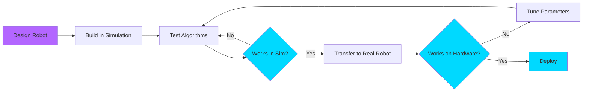

# Gazebo: Your Robot's Virtual World

**Learning Objectives**:
- Understand why simulation is critical before hardware
- Set up Gazebo for ROS 2
- Launch your first simulated robot
- Configure physics properties

**Prerequisites**: Module 1 complete, Gazebo Garden or Harmonic installed

**Estimated Time**: 1 hour

---

## Why Simulate First?

:::tip The Golden Rule of Robotics
Test in simulation before touching real hardware. It's faster, safer, and cheaper.
:::

Imagine trying to teach a self-driving car on real streets—every bug could be fatal. Simulation lets us:
- **Iterate Fast**: Restart in seconds, not hours
- **Stay Safe**: No broken robots or injured people
- **Save Money**: No need for expensive hardware during development

---

## The Sim-to-Real Pipeline



---

## Launching Gazebo with ROS 2

### Installation Check

```bash
# Verify Gazebo is installed
gz sim --version

# Should output something like:
# Gazebo Sim, version 7.x.x (or 8.x.x for Harmonic)
```

### Your First World

Let's launch an empty world:

```bash
# Launch Gazebo with ROS 2 bridge
ros2 launch ros_gz_sim gz_sim.launch.py gz_args:="empty.sdf"
```

You should see an empty 3D environment with a ground plane.

---

## Spawning a Robot

### Code Example: Spawn Script

```python
# Example: Spawn a robot in Gazebo using ROS 2
# File: spawn_robot.py

import rclpy
from rclpy.node import Node
from gazebo_msgs.srv import SpawnEntity
import os

class RobotSpawner(Node):
    """Spawns a robot model in Gazebo simulation."""

    def __init__(self):
        super().__init__('robot_spawner')
        self.client = self.create_client(SpawnEntity, '/spawn_entity')

        while not self.client.wait_for_service(timeout_sec=1.0):
            self.get_logger().info('Waiting for /spawn_entity service...')

        self.spawn_robot()

    def spawn_robot(self):
        """Send spawn request to Gazebo."""
        request = SpawnEntity.Request()
        request.name = 'my_robot'
        request.xml = self.get_robot_description()
        request.robot_namespace = 'robot'
        request.initial_pose.position.x = 0.0
        request.initial_pose.position.y = 0.0
        request.initial_pose.position.z = 0.5

        future = self.client.call_async(request)
        rclpy.spin_until_future_complete(self, future)

        if future.result() is not None:
            self.get_logger().info(f'Robot spawned: {future.result().status_message}')
        else:
            self.get_logger().error('Failed to spawn robot')

    def get_robot_description(self) -> str:
        """Load robot SDF/URDF description."""
        # Simplified SDF for a box robot
        return """
        <?xml version="1.0"?>
        <sdf version="1.6">
          <model name="simple_box">
            <link name="base_link">
              <visual name="visual">
                <geometry>
                  <box><size>0.5 0.3 0.2</size></box>
                </geometry>
              </visual>
              <collision name="collision">
                <geometry>
                  <box><size>0.5 0.3 0.2</size></box>
                </geometry>
              </collision>
            </link>
          </model>
        </sdf>
        """

def main(args=None):
    rclpy.init(args=args)
    spawner = RobotSpawner()
    spawner.destroy_node()
    rclpy.shutdown()

if __name__ == '__main__':
    main()
```

**How to run**:
```bash
# Terminal 1: Launch Gazebo
ros2 launch ros_gz_sim gz_sim.launch.py

# Terminal 2: Spawn the robot
python3 spawn_robot.py
```

---

## Physics Properties

Gazebo simulates real-world physics:

| Property | What It Affects | Example Values |
|----------|----------------|----------------|
| **Gravity** | How fast objects fall | `-9.81 m/s²` (Earth) |
| **Friction** | How slippery surfaces are | `0.0` (ice) to `1.0` (rubber) |
| **Mass** | Inertia and momentum | `5.0 kg` |
| **Damping** | Energy loss over time | `0.01` (low) to `1.0` (high) |

---

## Summary

**Key Takeaways**:
- Simulation saves time, money, and prevents hardware damage
- Gazebo provides physics-accurate virtual environments
- Robots are spawned using SDF (Simulation Description Format)
- The sim-to-real pipeline is: Design → Sim → Tune → Deploy

**Next Steps**: In the [next chapter](./02-unity.md), we'll explore Unity for high-fidelity human-robot interaction scenarios.

---

## Further Reading

- [Gazebo Official Tutorials](https://gazebosim.org/docs)
- [ROS 2 + Gazebo Integration](https://github.com/gazebosim/ros_gz)
- [SDF Format Specification](http://sdformat.org/)
