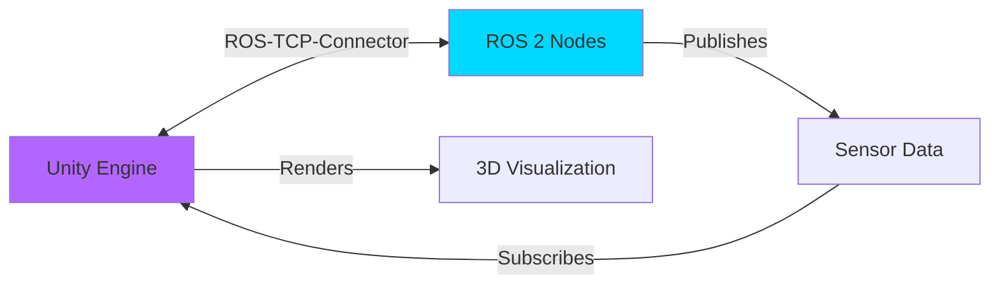

# Unity: High-Fidelity Human-Robot Interaction

**Learning Objectives**:
- Understand when to use Unity vs Gazebo
- Set up Unity with ROS 2
- Create photorealistic environments
- Visualize robot behavior in real-time

**Prerequisites**: Module 2 Chapter 1, Unity 2021.3+ installed

**Estimated Time**: 1.5 hours

---

## Gazebo vs Unity: When to Use Each

| Feature | Gazebo | Unity |
|---------|--------|-------|
| **Physics Accuracy** | Excellent | Good |
| **Visual Quality** | Good | Excellent |
| **Best For** | Algorithm development | Visualization, HRI |
| **Learning Curve** | Moderate | Steep |
| **ROS Integration** | Native | Via TCP bridge |

:::tip Use Case
Use **Gazebo** for physics-critical tasks (navigation, manipulation). Use **Unity** for human-robot interaction, demos, and presentations.
:::

---

## Unity-ROS Integration Architecture



---

## Setting Up ROS-TCP-Connector

### Installation Steps

```bash
# 1. Install ROS-TCP-Endpoint (ROS 2 side)
cd ~/ros2_ws/src
git clone https://github.com/Unity-Technologies/ROS-TCP-Endpoint.git
cd ~/ros2_ws
colcon build --packages-select ros_tcp_endpoint

# 2. Source the workspace
source install/setup.bash

# 3. Launch the endpoint
ros2 run ros_tcp_endpoint default_server_endpoint --ros-args -p ROS_IP:=0.0.0.0
```

In Unity:
1. Open Package Manager (Window → Package Manager)
2. Add package from git URL: `https://github.com/Unity-Technologies/ROS-TCP-Connector.git`
3. Configure ROSConnectionPrefab with your machine's IP

---

## Code Example: Unity C# ROS Subscriber

```csharp
// Example: Subscribe to ROS 2 topic in Unity
// File: RobotPositionSubscriber.cs

using UnityEngine;
using RosMessageTypes.Geometry;

public class RobotPositionSubscriber : MonoBehaviour
{
    private ROSConnection ros;
    private string topicName = "/robot/pose";

    void Start()
    {
        // Initialize ROS connection
        ros = ROSConnection.GetOrCreateInstance();
        ros.RegisterSubscriber<PoseMsg>(topicName, UpdateRobotPosition);
    }

    void UpdateRobotPosition(PoseMsg poseMessage)
    {
        // Update Unity game object position based on ROS message
        Vector3 position = new Vector3(
            (float)poseMessage.position.x,
            (float)poseMessage.position.y,
            (float)poseMessage.position.z
        );

        transform.position = position;

        Debug.Log($"Robot position updated: {position}");
    }
}
```

**How to use**:
1. Attach this script to a robot GameObject in Unity
2. Run the ROS-TCP-Endpoint
3. Publish pose data from ROS 2:
   ```bash
   ros2 topic pub /robot/pose geometry_msgs/Pose "{position: {x: 1.0, y: 2.0, z: 0.5}}"
   ```
4. Watch the robot move in Unity!

---

## Creating a Photorealistic Environment

Unity excels at creating beautiful, realistic scenes:

1. **Use HDRP (High Definition Render Pipeline)** for photorealism
2. **Import 3D Assets** from Unity Asset Store or free sources
3. **Add Lighting** (directional, point, spotlight)
4. **Apply Post-Processing** (bloom, ambient occlusion, depth of field)

### Example: Indoor Lab Environment

```csharp
// Example: Simple scene setup script
// File: SceneSetup.cs

using UnityEngine;

public class SceneSetup : MonoBehaviour
{
    public GameObject robotPrefab;
    public Material floorMaterial;

    void Start()
    {
        CreateFloor();
        SpawnRobot();
        SetupLighting();
    }

    void CreateFloor()
    {
        GameObject floor = GameObject.CreatePrimitive(PrimitiveType.Plane);
        floor.transform.localScale = new Vector3(10, 1, 10);
        floor.GetComponent<Renderer>().material = floorMaterial;
    }

    void SpawnRobot()
    {
        Instantiate(robotPrefab, new Vector3(0, 0.5f, 0), Quaternion.identity);
    }

    void SetupLighting()
    {
        GameObject light = new GameObject("Directional Light");
        Light lightComponent = light.AddComponent<Light>();
        lightComponent.type = LightType.Directional;
        lightComponent.intensity = 1.5f;
        light.transform.rotation = Quaternion.Euler(50, -30, 0);
    }
}
```

---

## Hands-On Exercise

**Challenge**: Create a Unity scene where:
1. A robot cube subscribes to `/cmd_vel` (Twist messages)
2. The robot moves in Unity based on velocity commands
3. The scene includes a floor, lighting, and a camera following the robot

**Acceptance Criteria**:
- [ ] Unity scene renders without errors
- [ ] Robot responds to `ros2 topic pub /cmd_vel`
- [ ] Camera follows robot movement

---

## Summary

**Key Takeaways**:
- Unity provides photorealistic visualization for ROS 2 robots
- ROS-TCP-Connector bridges Unity and ROS 2
- C# scripts subscribe to topics and update GameObjects
- Unity is ideal for demos, HRI studies, and visual debugging

**Next Steps**: In the [next module](../module-03-robot-brain/01-isaac-sim.md), we'll explore NVIDIA Isaac Sim for AI-driven robotics!

---

## Further Reading

- [Unity Robotics Hub](https://github.com/Unity-Technologies/Unity-Robotics-Hub)
- [ROS-TCP-Connector Documentation](https://github.com/Unity-Technologies/ROS-TCP-Connector)
- [Unity HDRP Guide](https://docs.unity3d.com/Packages/com.unity.render-pipelines.high-definition@latest)
