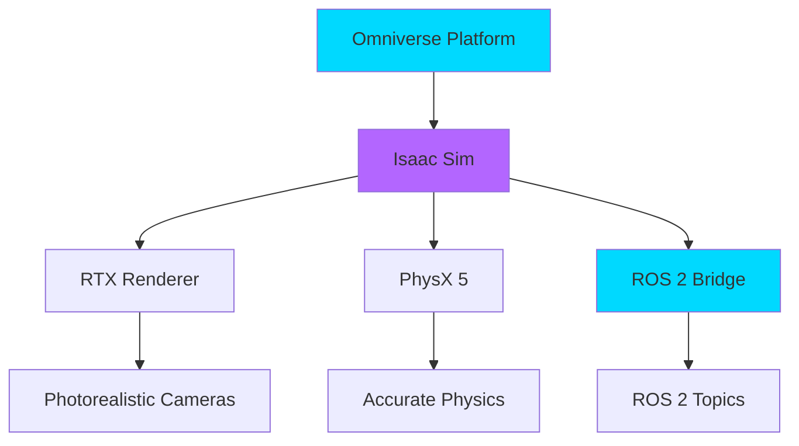

# NVIDIA Isaac Sim: Photorealistic Robot Simulation

**Learning Objectives**:
- Understand Isaac Sim's role in AI robotics
- Set up Isaac Sim with ROS 2
- Generate synthetic data for training
- Use RTX ray tracing for realistic sensors

**Prerequisites**: Module 2 complete, NVIDIA GPU (RTX series recommended)

**Estimated Time**: 2 hours

---

## What is Isaac Sim?

NVIDIA Isaac Sim is a robotics simulation platform built on **Omniverse**. It combines:
- **RTX Ray Tracing** for photorealistic rendering
- **PhysX 5** for accurate physics
- **ROS 2 Integration** for seamless workflow
- **Synthetic Data Generation** for AI training

:::tip Why Isaac Sim?
If Gazebo is a physics lab, Isaac Sim is a Hollywood movie studio—both simulate robots, but Isaac excels at AI and perception tasks.
:::

---

## System Requirements

| Component | Minimum | Recommended |
|-----------|---------|-------------|
| **GPU** | NVIDIA RTX 2060 | RTX 3080+ |
| **RAM** | 16 GB | 32 GB+ |
| **Storage** | 50 GB | 100 GB SSD |
| **OS** | Ubuntu 20.04 | Ubuntu 22.04 |

---

## Installation

```bash
# 1. Download Isaac Sim from NVIDIA
# Visit: https://developer.nvidia.com/isaac-sim

# 2. Extract and run
cd ~/.local/share/ov/pkg/isaac_sim-*
./isaac-sim.sh

# 3. Install ROS 2 bridge
./python.sh -m pip install --upgrade pip
./python.sh -m pip install rospy-message-converter
```

---

## Isaac Sim Architecture



---

## Your First Isaac Sim Scene

### Code Example: Spawn Robot in Isaac Sim

```python
# Example: Load a robot in Isaac Sim using Python API
# File: isaac_spawn.py

from isaacsim import SimulationApp

# Launch Isaac Sim headless or with GUI
simulation_app = SimulationApp({"headless": False})

from omni.isaac.core import World
from omni.isaac.core.robots import Robot
from omni.isaac.core.utils.stage import add_reference_to_stage

def main():
    # Create world
    world = World(stage_units_in_meters=1.0)
    world.scene.add_default_ground_plane()

    # Add a Franka robot from Isaac's asset library
    add_reference_to_stage(
        usd_path="/Isaac/Robots/Franka/franka.usd",
        prim_path="/World/Franka"
    )

    # Create robot object
    franka = world.scene.add(Robot(prim_path="/World/Franka", name="franka"))

    # Reset world
    world.reset()

    print("Franka robot loaded! Use Play button to start simulation.")

    # Run for 100 steps
    for i in range(100):
        world.step(render=True)

    simulation_app.close()

if __name__ == "__main__":
    main()
```

**How to run**:
```bash
# Inside Isaac Sim directory
./python.sh isaac_spawn.py
```

---

## Generating Synthetic Data

One of Isaac Sim's superpowers is creating **labeled training data** for AI.

### Replicator API Example

```python
# Example: Generate synthetic images with bounding boxes
# File: synthetic_data_gen.py

import omni.replicator.core as rep

with rep.new_layer():
    # Create camera
    camera = rep.create.camera(position=(2, 2, 2))

    # Create randomized scene
    cube = rep.create.cube(semantics=[("class", "box")])

    with rep.trigger.on_frame():
        # Randomize cube position
        with cube:
            rep.modify.pose(
                position=rep.distribution.uniform((-1, 0, -1), (1, 0.5, 1))
            )

    # Attach writers (save RGB + bounding boxes)
    rgb_writer = rep.WriterRegistry.get("BasicWriter")
    rgb_writer.initialize(output_dir="_output", rgb=True)

    bbox_writer = rep.WriterRegistry.get("BoundingBox2DTight")
    bbox_writer.attach([camera])

# Run for 100 frames
rep.orchestrator.run()
```

This generates:
- **RGB images** (input for AI models)
- **Bounding box annotations** (ground truth labels)

---

## ROS 2 Integration

Isaac Sim can publish sensor data directly to ROS 2 topics.

### Enable ROS 2 Bridge

```python
from omni.isaac.core.utils.extensions import enable_extension

# Enable ROS 2 bridge extension
enable_extension("omni.isaac.ros2_bridge")
```

Now Isaac Sim cameras, LiDARs, and IMUs automatically publish to ROS 2 topics like:
- `/camera/rgb/image_raw`
- `/scan` (LiDAR)
- `/imu/data`

---

## Hands-On Exercise

**Challenge**: Create an Isaac Sim scene with:
1. A mobile robot (use built-in assets)
2. A camera that publishes to `/camera/rgb`
3. Randomized lighting and object positions

**Acceptance Criteria**:
- [ ] Scene loads without errors
- [ ] Camera data appears in ROS 2: `ros2 topic echo /camera/rgb/image_raw`
- [ ] Objects randomize on each reset

---

## Summary

**Key Takeaways**:
- Isaac Sim excels at photorealistic rendering and synthetic data
- Built on Omniverse with RTX ray tracing
- Replicator API generates labeled training datasets
- Seamless ROS 2 integration for perception tasks

**Next Steps**: In the [next chapter](./02-nav2.md), we'll use this simulated data for autonomous navigation with Nav2!

---

## Further Reading

- [Isaac Sim Official Documentation](https://docs.omniverse.nvidia.com/isaacsim/latest/)
- [Replicator Tutorial](https://docs.omniverse.nvidia.com/extensions/latest/ext_replicator.html)
- [Isaac Sim ROS 2 Bridge](https://docs.omniverse.nvidia.com/isaacsim/latest/ros2_tutorials/index.html)
