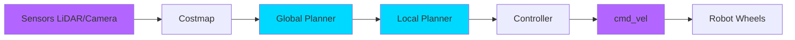
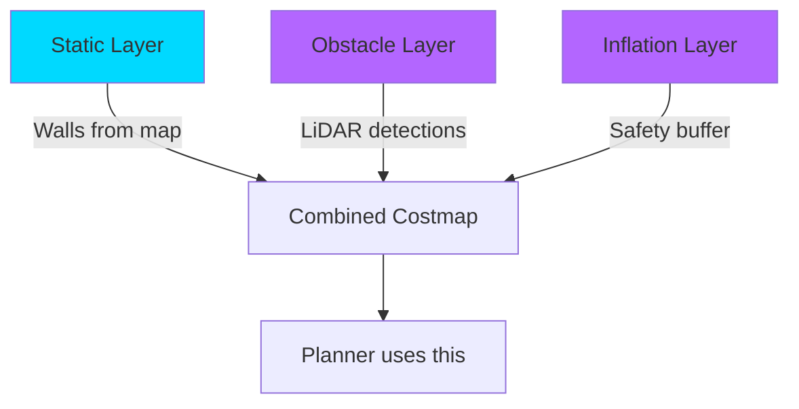

# Nav2: Autonomous Navigation Stack

**Learning Objectives**:
- Understand the Nav2 architecture
- Configure costmaps for obstacle avoidance
- Implement SLAM for mapping
- Deploy path planning algorithms

**Prerequisites**: Module 3 Chapter 1, basic understanding of coordinate frames

**Estimated Time**: 2 hours

---

## What is Nav2?

**Nav2** (Navigation 2) is the ROS 2 navigation stack. It answers the question:

> "How does a robot get from point A to point B without hitting obstacles?"

Nav2 includes:
- **Costmaps** (obstacle representation)
- **Planners** (find paths)
- **Controllers** (follow paths)
- **Behavior Trees** (coordinate actions)

---

## Nav2 Pipeline Architecture



1. **Sensors** provide data (LiDAR scans, camera depth)
2. **Costmap** marks obstacles and free space
3. **Global Planner** finds the overall path
4. **Local Planner** adjusts for dynamic obstacles
5. **Controller** generates velocity commands
6. **Robot** executes motion

---

## Setting Up Nav2

### Installation

```bash
# Install Nav2
sudo apt install ros-humble-navigation2 ros-humble-nav2-bringup

# Install SLAM Toolbox
sudo apt install ros-humble-slam-toolbox
```

### Configuration Example

Nav2 uses YAML files for configuration. Here's a minimal example:

```yaml
# File: nav2_params.yaml

bt_navigator:
  ros__parameters:
    use_sim_time: True
    global_frame: map
    robot_base_frame: base_link

controller_server:
  ros__parameters:
    use_sim_time: True
    controller_frequency: 20.0
    FollowPath:
      plugin: "dwb_core::DWBLocalPlanner"
      min_vel_x: 0.0
      max_vel_x: 0.5
      max_vel_theta: 1.0

global_costmap:
  global_costmap:
    ros__parameters:
      use_sim_time: True
      robot_radius: 0.22
      resolution: 0.05
      plugins: ["static_layer", "obstacle_layer", "inflation_layer"]

local_costmap:
  local_costmap:
    ros__parameters:
      use_sim_time: True
      robot_radius: 0.22
      resolution: 0.05
      plugins: ["obstacle_layer", "inflation_layer"]
```

---

## SLAM: Simultaneous Localization and Mapping

Before navigating, the robot needs a **map**. SLAM builds the map while exploring.

### Running SLAM Toolbox

```bash
# Terminal 1: Launch your robot in Gazebo
ros2 launch my_robot gazebo.launch.py

# Terminal 2: Launch SLAM Toolbox
ros2 launch slam_toolbox online_async_launch.py

# Terminal 3: Drive the robot around manually
ros2 run teleop_twist_keyboard teleop_twist_keyboard

# Terminal 4: Visualize in RViz
rviz2 -d $(ros2 pkg prefix nav2_bringup)/share/nav2_bringup/rviz/nav2_default_view.rviz
```

As you drive, the map builds in RViz!

### Save the Map

```bash
# Save the map
ros2 run nav2_map_server map_saver_cli -f my_map
```

This creates:
- `my_map.pgm` (image file)
- `my_map.yaml` (metadata: resolution, origin)

---

## Autonomous Navigation

Once you have a map, Nav2 can navigate autonomously.

### Launch Nav2

```bash
# Launch Nav2 with your map
ros2 launch nav2_bringup bringup_launch.py \
  use_sim_time:=True \
  map:=/path/to/my_map.yaml \
  params_file:=/path/to/nav2_params.yaml
```

### Send a Goal

```python
# Example: Send navigation goal programmatically
# File: send_goal.py

import rclpy
from rclpy.node import Node
from geometry_msgs.msg import PoseStamped
from nav2_simple_commander.robot_navigator import BasicNavigator

class GoalSender(Node):
    def __init__(self):
        super().__init__('goal_sender')
        self.navigator = BasicNavigator()

        # Wait for Nav2 to be ready
        self.navigator.waitUntilNav2Active()

        # Create goal pose
        goal_pose = PoseStamped()
        goal_pose.header.frame_id = 'map'
        goal_pose.header.stamp = self.navigator.get_clock().now().to_msg()
        goal_pose.pose.position.x = 2.0
        goal_pose.pose.position.y = 1.0
        goal_pose.pose.orientation.w = 1.0  # Facing forward

        # Send goal
        self.navigator.goToPose(goal_pose)

        # Wait for result
        while not self.navigator.isTaskComplete():
            feedback = self.navigator.getFeedback()
            self.get_logger().info(f'Distance remaining: {feedback.distance_remaining:.2f}m')

        result = self.navigator.getResult()
        if result == TaskResult.SUCCEEDED:
            self.get_logger().info('Goal reached!')
        else:
            self.get_logger().info('Goal failed!')

def main():
    rclpy.init()
    node = GoalSender()
    node.destroy_node()
    rclpy.shutdown()

if __name__ == '__main__':
    main()
```

**How to run**:
```bash
python3 send_goal.py
```

Watch the robot autonomously navigate to (2.0, 1.0)!

---

## Costmap Layers Explained

Nav2 uses **costmaps** to represent the world. Three layers:



1. **Static Layer**: Permanent obstacles from the saved map
2. **Obstacle Layer**: Dynamic obstacles (people, chairs)
3. **Inflation Layer**: Adds a safety buffer around obstacles

---

## Hands-On Exercise

**Challenge**: Create a Nav2 setup that:
1. Uses SLAM to build a map of a simulated environment
2. Saves the map
3. Navigates autonomously to 3 waypoints: (1,1), (3,2), (0,0)

**Acceptance Criteria**:
- [ ] Map is successfully saved as a `.pgm` file
- [ ] Robot reaches all waypoints without collision
- [ ] Costmap inflation is visible in RViz

**Hints**:
- Use `slam_toolbox` for mapping
- Use `nav2_simple_commander` for waypoint following
- Adjust `robot_radius` in config if collisions occur

---

## Summary

**Key Takeaways**:
- Nav2 is the ROS 2 navigation stack (costmaps, planners, controllers)
- SLAM builds maps while exploring
- Costmaps have 3 layers: static, obstacle, inflation
- `nav2_simple_commander` makes goal sending easy

**Next Steps**: In the [next module](../module-04-vla/01-whisper.md), we'll add voice control using AI!

---

## Further Reading

- [Nav2 Official Documentation](https://navigation.ros.org/)
- [SLAM Toolbox Guide](https://github.com/SteveMacenski/slam_toolbox)
- [Nav2 Tuning Guide](https://navigation.ros.org/tuning/index.html)
