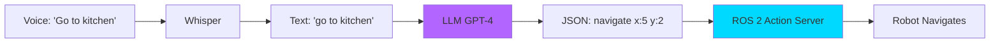

# LLM Control: Natural Language to Robot Actions

**Learning Objectives**:
- Understand how LLMs parse robot commands
- Integrate GPT-4 or Gemini with ROS 2
- Convert natural language to structured actions
- Implement safety validation for LLM outputs

**Prerequisites**: Module 4 Chapter 1, OpenAI or Google API key

**Estimated Time**: 2 hours

---

## From Speech to Action

We've conquered **speech-to-text** with Whisper. Now we need to:
1. **Parse** the text (What does "go to the kitchen" mean?)
2. **Generate** ROS 2 actions (Navigate to coordinates X, Y)
3. **Execute** the action (Robot moves)

This is where **Large Language Models** come in.



---

## Why LLMs for Robotics?

Traditional approach:
```python
if "forward" in command:
    move_forward()
elif "left" in command:
    turn_left()
# ... hundreds of if-statements
```

**Problem**: Brittle, can't handle variations like "go ahead", "advance", "proceed".

**LLM Approach**:
```python
response = llm.parse("Can you move forward a bit?")
# LLM understands intent: {"action": "move", "direction": "forward", "distance": "short"}
```

LLMs handle:
- **Synonyms** (forward/ahead/advance)
- **Context** (a bit → small distance)
- **Ambiguity** resolution

---

## Setting Up OpenAI API

### Installation

```bash
pip install openai
```

### API Key

```bash
# Add to ~/.bashrc or set temporarily
export OPENAI_API_KEY="sk-..."
```

---

## Code Example: LLM Command Parser

```python
# Example: Parse robot commands using GPT-4
# File: llm_parser.py

from openai import OpenAI
import json

class RobotCommandParser:
    """Parses natural language commands using GPT-4."""

    def __init__(self):
        self.client = OpenAI()  # Reads API key from environment

    def parse_command(self, user_input: str) -> dict:
        """
        Convert natural language to structured robot command.

        Args:
            user_input: Natural language command (e.g., "go to the kitchen")

        Returns:
            Dict with action type and parameters
        """
        system_prompt = """
        You are a robot command parser. Convert natural language to JSON.

        Available actions:
        - navigate: {"action": "navigate", "location": "kitchen"}
        - move: {"action": "move", "direction": "forward", "distance_meters": 2.0}
        - turn: {"action": "turn", "direction": "left", "angle_degrees": 90}
        - grasp: {"action": "grasp", "object": "cup"}
        - stop: {"action": "stop"}

        Examples:
        "go to the kitchen" → {"action": "navigate", "location": "kitchen"}
        "move forward 2 meters" → {"action": "move", "direction": "forward", "distance_meters": 2.0}
        "turn right" → {"action": "turn", "direction": "right", "angle_degrees": 90}

        Only output valid JSON. If unclear, ask for clarification.
        """

        response = self.client.chat.completions.create(
            model="gpt-4",
            messages=[
                {"role": "system", "content": system_prompt},
                {"role": "user", "content": user_input}
            ],
            temperature=0.0  # Deterministic output
        )

        # Extract JSON from response
        result_text = response.choices[0].message.content
        try:
            return json.loads(result_text)
        except json.JSONDecodeError:
            return {"action": "error", "message": result_text}

def main():
    parser = RobotCommandParser()

    # Test commands
    commands = [
        "go to the kitchen",
        "move forward 3 meters",
        "turn left",
        "pick up the red cup"
    ]

    for cmd in commands:
        result = parser.parse_command(cmd)
        print(f"Input: {cmd}")
        print(f"Output: {json.dumps(result, indent=2)}\n")

if __name__ == "__main__":
    main()
```

**Expected output**:
```
Input: go to the kitchen
Output: {
  "action": "navigate",
  "location": "kitchen"
}

Input: move forward 3 meters
Output: {
  "action": "move",
  "direction": "forward",
  "distance_meters": 3.0
}

Input: turn left
Output: {
  "action": "turn",
  "direction": "left",
  "angle_degrees": 90
}

Input: pick up the red cup
Output: {
  "action": "grasp",
  "object": "cup",
  "color": "red"
}
```

---

## ROS 2 Integration

Now let's connect this to ROS 2 actions.

### Code Example: LLM to Nav2 Bridge

```python
# Example: LLM commands trigger Nav2 navigation
# File: llm_nav2_bridge.py

import rclpy
from rclpy.node import Node
from std_msgs.msg import String
from geometry_msgs.msg import PoseStamped
from nav2_simple_commander.robot_navigator import BasicNavigator
from openai import OpenAI
import json

class LLMNav2Bridge(Node):
    """Listens to voice commands, parses with LLM, executes with Nav2."""

    def __init__(self):
        super().__init__('llm_nav2_bridge')
        self.subscription = self.create_subscription(
            String,
            '/voice_command',
            self.command_callback,
            10
        )
        self.navigator = BasicNavigator()
        self.llm = OpenAI()

        # Predefined locations
        self.locations = {
            "kitchen": {"x": 5.0, "y": 2.0},
            "bedroom": {"x": -3.0, "y": 4.0},
            "living room": {"x": 0.0, "y": 0.0}
        }

    def command_callback(self, msg: String):
        """Receive voice command, parse with LLM, execute."""
        command = msg.data
        self.get_logger().info(f'Received: "{command}"')

        # Parse with LLM
        parsed = self.parse_with_llm(command)
        self.get_logger().info(f'Parsed: {parsed}')

        # Execute action
        if parsed["action"] == "navigate":
            location = parsed.get("location")
            if location in self.locations:
                self.navigate_to(location)
            else:
                self.get_logger().warn(f'Unknown location: {location}')

    def parse_with_llm(self, command: str) -> dict:
        """Use GPT-4 to parse command."""
        response = self.llm.chat.completions.create(
            model="gpt-4",
            messages=[
                {"role": "system", "content": "Parse robot commands to JSON. Actions: navigate, move, turn, stop."},
                {"role": "user", "content": command}
            ],
            temperature=0.0
        )
        return json.loads(response.choices[0].message.content)

    def navigate_to(self, location: str):
        """Send Nav2 goal to location."""
        coords = self.locations[location]
        goal = PoseStamped()
        goal.header.frame_id = 'map'
        goal.header.stamp = self.navigator.get_clock().now().to_msg()
        goal.pose.position.x = coords["x"]
        goal.pose.position.y = coords["y"]
        goal.pose.orientation.w = 1.0

        self.get_logger().info(f'Navigating to {location} at ({coords["x"]}, {coords["y"]})')
        self.navigator.goToPose(goal)

def main(args=None):
    rclpy.init(args=args)
    bridge = LLMNav2Bridge()
    rclpy.spin(bridge)
    bridge.destroy_node()
    rclpy.shutdown()

if __name__ == '__main__':
    main()
```

**How to test**:
```bash
# Terminal 1: Run Nav2 (with a map loaded)
ros2 launch nav2_bringup bringup_launch.py ...

# Terminal 2: Run the LLM bridge
python3 llm_nav2_bridge.py

# Terminal 3: Send voice command
ros2 topic pub /voice_command std_msgs/String "data: 'go to the kitchen'"

# Watch the robot navigate autonomously!
```

---

## Safety Validation

:::warning Critical
Never blindly execute LLM outputs! Always validate for safety.
:::

### Code Example: Command Validator

```python
# Example: Validate LLM outputs before execution
# File: safety_validator.py

class SafetyValidator:
    """Validates LLM outputs for safety."""

    ALLOWED_ACTIONS = ["navigate", "move", "turn", "stop"]
    MAX_DISTANCE = 10.0  # meters
    MAX_ANGLE = 360.0  # degrees

    def validate(self, command: dict) -> tuple[bool, str]:
        """
        Check if command is safe to execute.

        Returns:
            (is_valid, error_message)
        """
        action = command.get("action")

        # Check action is allowed
        if action not in self.ALLOWED_ACTIONS:
            return False, f"Forbidden action: {action}"

        # Validate move commands
        if action == "move":
            distance = command.get("distance_meters", 0)
            if distance > self.MAX_DISTANCE:
                return False, f"Distance too large: {distance}m > {self.MAX_DISTANCE}m"

        # Validate navigation
        if action == "navigate":
            location = command.get("location")
            if not location:
                return False, "No location specified"

        return True, "OK"
```

---

## Hands-On Exercise

**Challenge**: Build a full VLA pipeline:
1. Speak: "Go to the bedroom and then return to the living room"
2. Whisper transcribes
3. LLM parses into 2 sequential navigate actions
4. Robot executes both

**Acceptance Criteria**:
- [ ] LLM correctly identifies 2 navigation goals
- [ ] Robot navigates to both waypoints in sequence
- [ ] Safety validator rejects dangerous commands (e.g., "move 100 meters")

---

## Summary

**Key Takeaways**:
- LLMs parse natural language into structured robot commands
- GPT-4/Gemini handle synonyms, context, and ambiguity
- Always validate LLM outputs before execution
- Integration with Nav2 enables voice-controlled navigation

**Next Steps**: In the [Capstone Project](../module-05-capstone/01-project-brief.md), we'll build the full autonomous humanoid!

---

## Further Reading

- [OpenAI Function Calling](https://platform.openai.com/docs/guides/function-calling)
- [Google Gemini API](https://ai.google.dev/docs)
- [RT-2 Paper (Google)](https://robotics-transformer2.github.io/)
