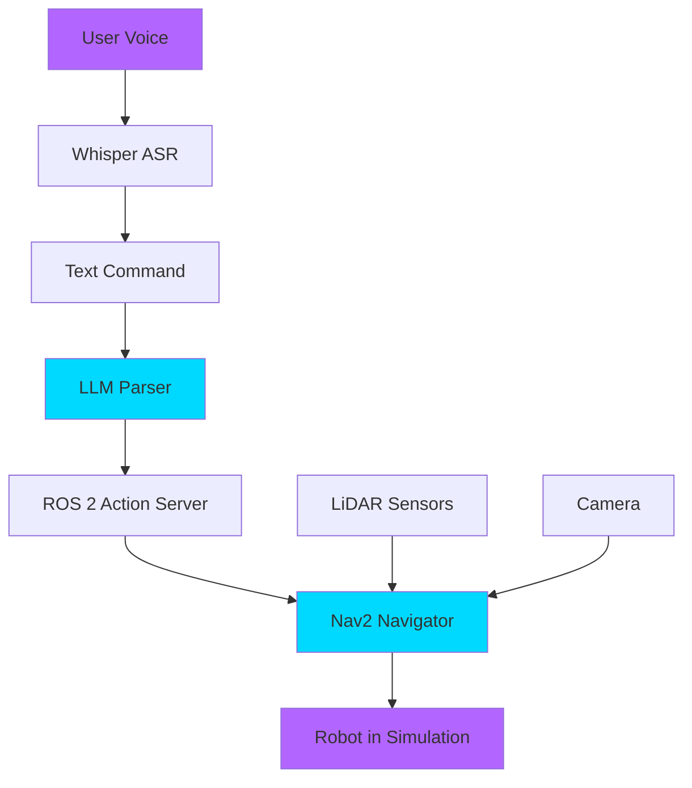

# Capstone Project: The Autonomous Humanoid

**Project Goal**: Build a fully autonomous humanoid robot that responds to voice commands, navigates obstacles, and executes tasks in simulation.

**Duration**: 4-8 hours (depending on experience)

**Prerequisites**: All Modules 1-4 complete

---

## Project Overview

You will integrate **everything** you've learned:

| Module | Component | Role in Capstone |
|--------|-----------|------------------|
| **Module 1** | ROS 2 Nodes | Communication backbone |
| **Module 2** | Simulation | Test environment (Gazebo/Isaac Sim) |
| **Module 3** | Nav2 + SLAM | Autonomous navigation |
| **Module 4** | Whisper + LLM | Voice-controlled commands |

---

## System Architecture



**Data Flow**:
1. **User** speaks: "Navigate to the kitchen and pick up the cup"
2. **Whisper** transcribes to text
3. **LLM (GPT-4)** parses into actions: `[navigate(kitchen), grasp(cup)]`
4. **ROS 2 Action Server** sequences the tasks
5. **Nav2** plans path and avoids obstacles
6. **Robot** executes in simulation
7. **Completion** reported back to user

---

## Requirements

### Functional Requirements

- [ ] **FR-001**: Robot responds to voice commands via microphone
- [ ] **FR-002**: Commands are transcribed using OpenAI Whisper
- [ ] **FR-003**: LLM (GPT-4 or Gemini) parses commands into structured actions
- [ ] **FR-004**: Robot navigates autonomously using Nav2
- [ ] **FR-005**: Robot avoids dynamic obstacles (people, furniture)
- [ ] **FR-006**: Robot executes at least 3 tasks: navigate, move, turn
- [ ] **FR-007**: Safety validator rejects dangerous commands
- [ ] **FR-008**: State machine tracks progress (Listening → Planning → Executing → Done)
- [ ] **FR-009**: All execution happens in Gazebo or Isaac Sim
- [ ] **FR-010**: User receives voice feedback on task completion

### Non-Functional Requirements

- [ ] **NFR-001**: Commands execute within 30 seconds
- [ ] **NFR-002**: Voice recognition accuracy >80%
- [ ] **NFR-003**: Navigation success rate >90% (no collisions)
- [ ] **NFR-004**: Code follows ROS 2 conventions with type hints
- [ ] **NFR-005**: System runs on standard laptop (no GPU required for MVP)

---

## Acceptance Criteria

**Scenario 1: Simple Navigation**
- **Given**: Robot is at origin (0, 0)
- **When**: User says "Go to the kitchen"
- **Then**: Robot navigates to predefined kitchen coordinates
- **And**: Arrives within 0.5m of target
- **And**: Announces "I have arrived at the kitchen"

**Scenario 2: Multi-Step Command**
- **Given**: Robot is at origin
- **When**: User says "Go to the bedroom, then return to the living room"
- **Then**: Robot navigates to bedroom
- **And**: Then navigates to living room
- **And**: Completes both tasks without collision

**Scenario 3: Safety Rejection**
- **Given**: Robot is operational
- **When**: User says "Move 100 meters forward"
- **Then**: Safety validator rejects the command
- **And**: Robot announces "Command rejected: distance exceeds safety limit"

---

## Implementation Checklist

### Phase 1: Environment Setup

- [ ] Create Gazebo world with 3 rooms (kitchen, bedroom, living room)
- [ ] Spawn a mobile robot (TurtleBot3 or similar)
- [ ] Add obstacles (tables, chairs)
- [ ] Build map using SLAM Toolbox
- [ ] Save map as `capstone_map.pgm`

### Phase 2: Voice Pipeline

- [ ] Create `voice_node.py` that captures audio and publishes to `/voice_command`
- [ ] Integrate Whisper for transcription
- [ ] Test: Speak → See text on `/voice_command` topic

### Phase 3: LLM Integration

- [ ] Create `llm_parser_node.py` that subscribes to `/voice_command`
- [ ] Use GPT-4 to parse commands into JSON
- [ ] Publish structured actions to `/robot_actions` topic
- [ ] Test: "go to kitchen" → `{"action": "navigate", "location": "kitchen"}`

### Phase 4: Action Execution

- [ ] Create `action_executor_node.py` that subscribes to `/robot_actions`
- [ ] For `navigate` actions, send goals to Nav2
- [ ] For `move` actions, publish to `/cmd_vel`
- [ ] For `turn` actions, publish angular velocity
- [ ] Test: JSON command → Robot moves

### Phase 5: Safety & State Machine

- [ ] Create `safety_validator.py` module
- [ ] Validate distance limits (&lt;10m), angle limits (&lt;360°)
- [ ] Reject forbidden actions (e.g., "delete files")
- [ ] Implement state machine: Idle → Listening → Planning → Executing → Done
- [ ] Test: "move 100 meters" → Rejected

### Phase 6: Integration Testing

- [ ] Run full pipeline end-to-end
- [ ] Test all 3 acceptance scenarios
- [ ] Record video of robot completing multi-step command
- [ ] Document any failures and fixes

---

## Starter Code Structure

```text
capstone_project/
├── launch/
│   └── capstone.launch.py          # Launches all nodes
├── config/
│   ├── nav2_params.yaml            # Nav2 configuration
│   └── locations.yaml              # Predefined locations (kitchen, etc.)
├── nodes/
│   ├── voice_node.py               # Whisper ASR
│   ├── llm_parser_node.py          # GPT-4 parser
│   ├── action_executor_node.py     # Executes actions
│   └── state_machine_node.py       # Tracks state
├── modules/
│   ├── safety_validator.py         # Validates commands
│   └── text_to_speech.py           # Voice feedback (optional)
├── worlds/
│   └── capstone_world.sdf          # Gazebo world
├── maps/
│   ├── capstone_map.pgm            # SLAM-generated map
│   └── capstone_map.yaml           # Map metadata
└── README.md                        # Setup instructions
```

---

## Rubric (Self-Assessment)

| Criterion | Points | Your Score |
|-----------|--------|------------|
| Voice recognition works | 15 | ___ |
| LLM correctly parses 5+ command types | 20 | ___ |
| Robot navigates without collision | 20 | ___ |
| Multi-step commands execute in sequence | 15 | ___ |
| Safety validator rejects dangerous commands | 10 | ___ |
| State machine implemented | 10 | ___ |
| Code quality (type hints, comments) | 5 | ___ |
| Documentation (README, code comments) | 5 | ___ |
| **Total** | **100** | ___ |

**Grading Scale**:
- 90-100: Excellent
- 75-89: Good
- 60-74: Satisfactory
- Below 60: Needs Improvement

---

## Next Steps After Completion

🎉 **Congratulations!** You've built a voice-controlled autonomous robot!

**Where to go from here**:
1. **Deploy to Hardware**: Transfer your code to a real TurtleBot3 or Spot robot
2. **Add Vision**: Integrate object detection (YOLOv8) for "pick up the red cup"
3. **Multi-Robot Coordination**: Control a fleet of robots
4. **Contribute to Open Source**: Share your project on GitHub
5. **Learn More**:
   - [MoveIt 2](https://moveit.ros.org/) for robot manipulation
   - [Behavior Trees](https://navigation.ros.org/behavior_trees/index.html) for complex task planning
   - [OpenVLA](https://openvla.github.io/) for vision-language-action models

---

## Resources

- **Sample Project**: [GitHub: ROS2-VLA-Capstone](https://github.com/example/ros2-vla-capstone)
- **Discord Community**: [Physical AI Learners](https://discord.gg/example)
- **Office Hours**: Every Friday 3-5 PM UTC (link TBD)
- **Feedback Form**: [Submit your project](https://forms.gle/example)

---

**Good luck, and enjoy building the future of robotics!** 🤖⚡
